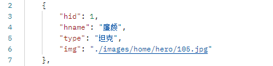
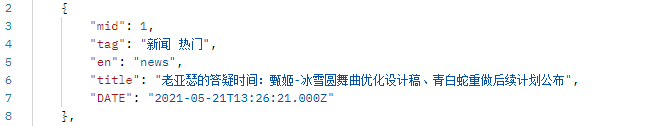
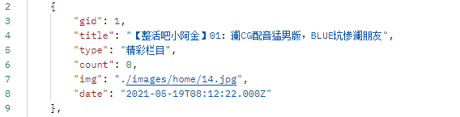

# 王者荣耀移动端

# 查询所有已实现接口

>键为接口名称，值为接口路径

## 轮播图

### 基本信息

**Path：** /getSlide/

**Method：** GET

**接口描述：** 

1. 线上接口地址：http://localhost:3306/getSlide
2. 返回HTTP状态码

3. 返回值

 

### 请求参数

### 返回数据

| 名称 | 类型   | 备注     |
| :--- | :----- | :------- |
| sid  | Number | id值     |
| img  | String | 图片地址 |

## 获取英雄

### 基本信息

**Path：** /getHero/

**Method：** GET

**接口描述：** 

1. 线上接口地址：http://localhost:3306/getHero
2. 返回HTTP状态码

3. 返回值

 

### 请求参数

### 返回数据

| 名称  | 类型   | 备注     |
| :---- | :----- | :------- |
| hid   | Number | id值     |
| hname | String | 英雄名称 |
| type  | String | 分路     |
| img   | String | 图片地址 |

## 新闻资讯

### 基本信息

**Path：** /getMessage/

**Method：** GET

**接口描述：** 

1. 线上接口地址：http://localhost:3306/getMessage
2. 返回HTTP状态码

3. 返回值

  

### 请求参数

### 返回数据

| 名称  | 类型   | 备注     |
| :---- | :----- | :------- |
| mid   | Number | id值     |
| tag   | String | 类型     |
| en    | String | 唯一表示 |
| title | String | 标题信息 |
| DATE  | String | 创建时间 |

## 精彩视频

### 基本信息

**Path：** /getGreatvideo/

**Method：** GET

**接口描述：** 

1. 线上接口地址：http://localhost:3306/getGreatvideo
2. 返回HTTP状态码

3. 返回值

  

### 请求参数

### 返回数据

| 名称  | 类型   | 备注     |
| :---- | :----- | :------- |
| gid   | Number | id值     |
| title | String | 标题信息 |
| type  | String | 分类     |
| count | Number | 浏览量   |
| img   | String | 图片地址 |
| date  | String | 创建时间 |

